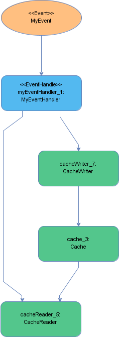

# Dirty node monitoring

The goal is to only let the execution path proceed if a node marks itself as being dirty.

Sometimes it is useful to only let the event wave progress if the current node marks itself as being dirty. For example  a level monitor will swallow the event wave unless the level is breached. An OnEvent method with a boolean return type is monitored as a dirty status flag by Fluxtion with the following rules:

* A true value marks the node as dirty and the event wave propagates.
* A false value swallows the event wave and no child OnEvent methods are invoked.
* A void return from OnEvent is presumed as a persistent value of true which will always propagate events.
* If a child has multiple parents any parent change propagates the event wave i.e. an "_or rule_" is applied.


Dirty filtering support can be toggled on or off using the **supportDirtyFiltering** property in the SEPConfig builder.


#### Example

We create a node, DirtyNode, that reports its dirty status with the return of its OnEvent method. Three DirtyNode's are created and each DirtyNode listens to one of two event handlers. The three DirtyNodes are aggregated in a class, DirtyNodeAggregator. The OnEvent method of `DirtyNodeAggregator.publishDirty()`, will be protected by guard conditions that check at least one parent is dirty before being invoked.

The DirtyNode

```java
public class DirtyNode {
    private final Object parent;

    public DirtyNode(Object parent) {
        this.parent = parent;
    }
    
    @OnEvent
    public boolean isDirty(){
        return true;
    }
}
```

DirtyNodeAggregator

```java
public class DirtyAggregator {
    private final DirtyNode node1;
    private final DirtyNode node2;
    private final DirtyNode node3;

    public DirtyAggregator(DirtyNode node1, DirtyNode node2, DirtyNode node3) {
        this.node1 = node1;
        this.node2 = node2;
        this.node3 = node3;
    }
    
    @OnEvent
    public void publishDirty(){
        
    }
}
```

The builder class used to declare the processing graph:

```java
public class Builder extends SEPConfig {

    @Override
    public void buildConfig() {
        DataEventHandler dataHandler_1 = addNode(new DataEventHandler());
        MyEventHandler myEventHandler_2 = addNode(new MyEventHandler());
        
        DirtyNode node1 = addNode(new DirtyNode(dataHandler_1));
        DirtyNode node2 = addNode(new DirtyNode(dataHandler_1));
        DirtyNode node3 = addNode(new DirtyNode(myEventHandler_2));
        
        DirtyAggregator aggregator = addNode(new DirtyAggregator(node1, node2, node3));
    }

}
```

#### Generated SEP

The following SEP is generated by Fluxtion. Note the guard conditions protecting the invocation of the aggregator. Fluxtion creates a boolean variable for each guard conditions, the variables are reset in the afterEvent method, which is automatically invoked by the SEP.

```java
public class SampleProcessor implements EventHandler, BatchHandler, Lifecycle {

  //Node declarations
  private final DataEventHandler dataEventHandler_1 = new DataEventHandler();
  private final DirtyNode dirtyNode_5 = new DirtyNode(dataEventHandler_1);
  private final DirtyNode dirtyNode_7 = new DirtyNode(dataEventHandler_1);
  private final MyEventHandler myEventHandler_3 = new MyEventHandler();
  private final DirtyNode dirtyNode_9 = new DirtyNode(myEventHandler_3);
  private final DirtyAggregator dirtyAggregator_11 =
      new DirtyAggregator(dirtyNode_7, dirtyNode_5, dirtyNode_9);
  //Dirty flags
  private boolean isDirty_dirtyNode_7 = false;
  private boolean isDirty_dirtyNode_9 = false;
  private boolean isDirty_dirtyNode_5 = false;
  //Filter constants

  public SampleProcessor() {}

//code omitted for clarity

  public void handleEvent(DataEvent typedEvent) {
    //Default, no filter methods
    dataEventHandler_1.handleEvent(typedEvent);
    isDirty_dirtyNode_5 = dirtyNode_5.isDirty();
    isDirty_dirtyNode_7 = dirtyNode_7.isDirty();
    if (isDirty_dirtyNode_7 | isDirty_dirtyNode_5 | isDirty_dirtyNode_9) {
      dirtyAggregator_11.publishDirty();
    }
    //event stack unwind callbacks
    afterEvent();
  }

  public void handleEvent(MyEvent typedEvent) {
    //Default, no filter methods
    myEventHandler_3.handleEvent(typedEvent);
    isDirty_dirtyNode_9 = dirtyNode_9.isDirty();
    if (isDirty_dirtyNode_7 | isDirty_dirtyNode_5 | isDirty_dirtyNode_9) {
      dirtyAggregator_11.publishDirty();
    }
    //event stack unwind callbacks
    afterEvent();
  }

  @Override
  public void afterEvent() {
    isDirty_dirtyNode_7 = false;
    isDirty_dirtyNode_9 = false;
    isDirty_dirtyNode_5 = false;
  }


}
```

 The graphical representation of this execution graph as generated by Fluxtion ESC:



