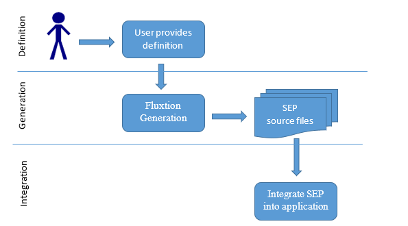

# Developer workflow

## Introduction

Creating a Static Event processor involves three distinct phases for a developer:

1. Definition - User supplied configuration to Fluxtion.
2. Generation - Fluxtion processes the configuration and applies processing inference to generate a static event processor \(SEP\).
3. Integration – Integrate the generated SEP into a user application or library.

      An example of the steps covered is in the [quick start](../untitled.md) example.

## Maven based workflow

The steps a developer should follow to execute the fluxtion event stream compiler via maven as part of the standard workflow are:

#### setup

* Create a[ maven project ](../tools/maven-plugin.md#fluxtion-dependencies)declaring Fluxtion libraries as dependencies.
* Add the [fluxtion maven plugin](../tools/maven-plugin.md#add-build-plugins) to the build plugins, setting configuration.

#### definition

* Write application classes representing nodes and events to fulfill [event processing](https://fluxtion.gitbook.io/docs/overview/child-2) requirement.
* Create meta-data describing the [construction of the execution graph](https://fluxtion.gitbook.io/docs/overview/graph-building-primitives).

#### generation

* Run a mvn [build](../tools/maven-plugin.md#run-build).

#### integration

* Integrate the generated SEP into the [application](../untitled.md#step-4-integrate-sep).

