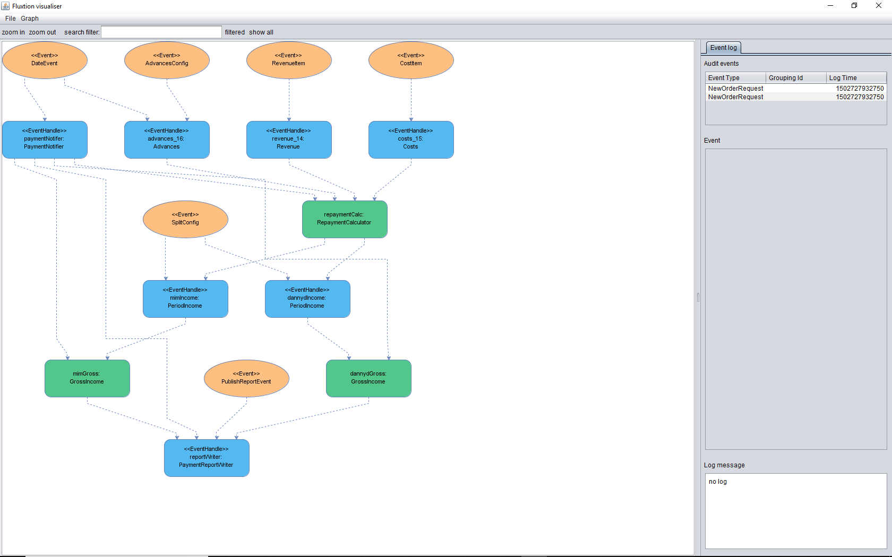
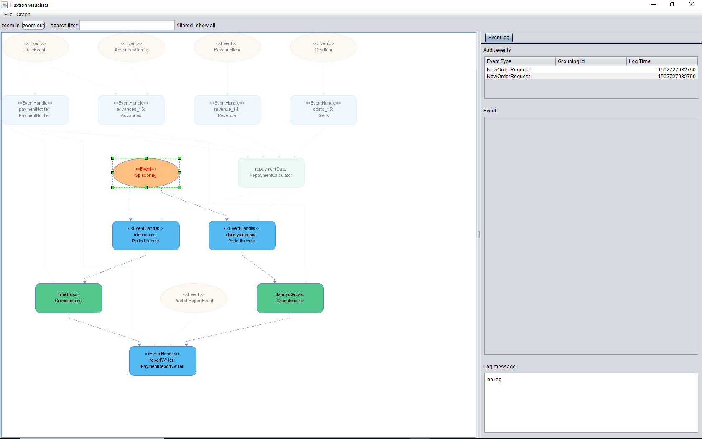
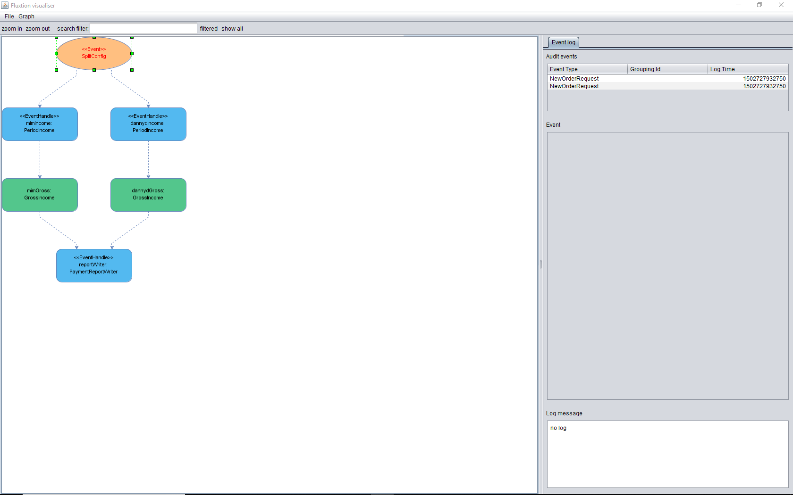
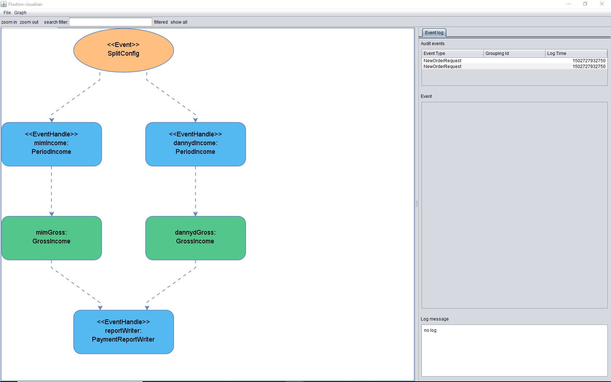

# Visual analyser

## Introduction

Fluxtion provides a graph visualiser as part of its tool suite. The goal of the visualiser is to allow non-developers to understand the processing logic in the generated SEP. The visualiser provides the following functionality:

* load a graphml generated by fluxtion esc for rendering
* Clearly identify, events, nodes and event handlers
* Inidicate stereotype, class type and instance name
* Indicate event event propagation direction and dependencies
* Search for nodes by name
* Zoom in/out
* Drag and drop loading
* Click node showing execution path memberships
* Double click node shows direct parents and children
* Export current view to png
* Load history for quick graphml loading
* Designed for plugin extension

## Executing visualiser

The visualiser is distributed as an [executable jar](https://github.com/v12technology/fluxtion-visualiser/blob/master/dist/fluxtion-visualiser.jar) located in its dist directory and can be run by double clicking on the jar or with java -jar  from the command line. 

### Loading graphml

To load a graphml navigate to the generated graphml file and drop onto the main window of the application, see [video clip on youtube](https://www.youtube.com/watch?v=rZrooItHlUM).

### Filtering

Graphs can become complex and difficult to read, visualiser allows filtering based on connected nodes or via string match. 

* For connected node filtering click a node this will blur any non-connected nodes
* 

To remove disconnected nodes, keyboard shortcut 'f' \(filter\) or menu: graph/sjow only filtered. 

### Reload/remove filter

To reload the graphml file use keyboard shortcut 'r' \(reload\) or menu: Graph/reload from file

### Zooming

The active image can be zoomed in out with the toolbar items or keyboard shortcut 'i' \(zoom in\) 'o' \(zoom out\)

  

